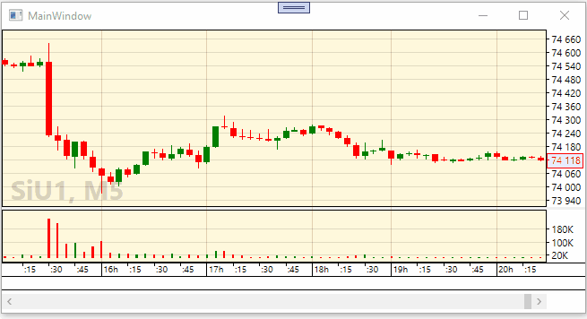

# QuikConnector

Библиотека QuikConnector позволяет вашему приложению создать соединение с биржевым терминалом [Quik](https://ru.wikipedia.org/wiki/QUIK) для получения в реальном времени котировок финансовых иснтрументов. QuikConnector создана преимущественно для работы в связке с библиотекой биржевых графиков [FancyCandles](https://github.com/gellerda/FancyCandles), но вы можете использовать ее и другим нужным вам способом. Для обмена данными с терминалом Quik используется технология [Разделяемой памяти](https://ru.wikipedia.org/wiki/Разделяемая_память). Благодаря этому вы получаете максимальную скорость передачи данных из Quik в ваше приложение.

Платформа: .NET Framework.

## Как это работает?

Коннектор состоит из трех блоков, каждый из которых имеет в репозитории свою отдельную папку:

1. Модуль *LuaFMConnector.dll*, написанный на языке С, который подключается LUA-скриптом *QuikDataExporter.lua* (2) и предоставляет функции для чтения и записи данных в [Разделяемую память](https://ru.wikipedia.org/wiki/Разделяемая_память). Проект этого модуля находится в папке *LuaFMConnector*.

2. Скрипт *QuikDataExporter.lua* на язке LUA, который вы запускаете из терминала Quik. Он подключает модуль *LuaFMConnector.dll* (1), читает с его помощью запросы из *Разделяемой памяти* и записывает биржевые данные из терминала Quik в *Разделяемую память*.

3. Библиотека *QuikDataImporter* для платформы .NET Framework, написанная на языке C#. Она записывает в *Разделяемую память* запросы на получение конкретных биржевых котировок, и читает из нее данные, записанные скриптом *QuikDataExporter.lua* (2). Класс **QuikDataImporter.QuikCandlesSourceProvider** реализует интерфейс [FancyCandles.ICandlesSourceProvider](https://gellerda.github.io/FancyCandles/api/FancyCandles.ICandlesSourceProvider.html) и предоставляет биржевые данные, получаемые в реальном времени из терминала Quik. 

## Getting started

1. Проект из данного репозитория ссылается на два других проекта: [FancyPrimitives](https://github.com/gellerda/FancyPrimitives) и [FancyCandles](https://github.com/gellerda/FancyCandles). Склонируйте репозитории этих двух проектов и данный репозиторий [QuikConnector](https://github.com/gellerda/QuikConnector) в одну папку. Т.е. в итоге у вас должна получиться следующая структура папок c репозиториями:

    *-SomeRootFolder* 
    &nbsp;&nbsp;&nbsp;&nbsp;*-FancyCandles* 
    &nbsp;&nbsp;&nbsp;&nbsp;*-FancyPrimitives* 
    &nbsp;&nbsp;&nbsp;&nbsp;*-QuikConnector*

2. Откройте решение *"LuaFMConnector/LuaFMConnector.sln"*. Выставите конфигурацию и платформу решения: *"Release x86"* или *"Release x64"* в зависимости от версии Windows, которой вы пользуетесь. Выполните команду Rebuild для проекта *LuaFMConnector*. В папке *"LuaFMConnector"* появится папка *"x86\Release"* или *"x64\Release"* в которой вы найдете файл *LuaFMConnector.dll*. Скопируйте этот файл в корневой каталог вашего терминала Quik.

3. Скопируйте файл *"QuikDataExporter/QuikDataExporter.lua"* в корневой каталог вашего терминала Quik.

4. Откройте терминал Quik и запустите скрипт *"QuikDataExporter/QuikDataExporter.lua"*. Для этого выберите в меню терминала *"Сервисы/Lua скрипты.../Добавить"*, найдите и выберите файл скрипта, нажмите *"Запустить в Lua 5.3.5"*.  

5. Откройте решение *"QuikDataImporter/QuikDataImporter.sln"*. Запустите проект *QuikDataImporterExample*. Последовательность выполнения пунктов 3 и 4 не имеет значения.

Поздравляем! Вы запустили тестовый проект. На экране должен появится свечной график, данные для которого получены из терминала Quik и обновляются в реальном времени. Через контекстное меню можете изменить финансовый инструмент и таймфрейм.

Все что делает проект *QuikDataImporter* - это всего лишь реализует интерфейсы [FancyCandles.ICandlesSourceProvider](https://gellerda.github.io/FancyCandles/api/FancyCandles.ICandlesSourceProvider.html) и [FancyCandles.ICandle](https://gellerda.github.io/FancyCandles/api/FancyCandles.ICandle.html), объявленные в библиотеке [FancyCandles](https://github.com/gellerda/FancyCandles). А в проекте *QuikDataImporterExample* мы используем эти реализации совместно с контролом свечного графика [FancyCandles.CandleChart](https://gellerda.github.io/FancyCandles/api/FancyCandles.CandleChart.html) из той же библиотеки [FancyCandles](https://github.com/gellerda/FancyCandles).

## Документация FancyCandles
Только что запущенный вами тестовый проект использует библиотеку биржевых графиков [FancyCandles](https://github.com/gellerda/FancyCandles), которая имеет прекрасную [документацию](https://gellerda.github.io/FancyCandles/) с разделом [Getting started](https://gellerda.github.io/FancyCandles/articles/creating_candlestick_chart.html).

## Есть вопросы?
Буду рад ответить на ваши вопросы и предложения. Найдете баги - открывайте Issue, исправим.

## License
[GNU GPLv3 license](https://github.com/gellerda/FancyCandles/blob/master/LICENSE).
